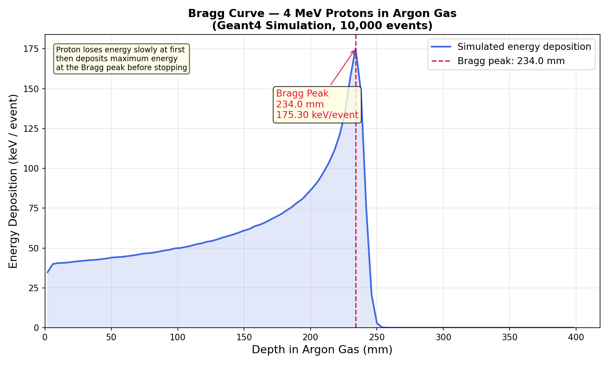

# Bragg Curve Simulation in Argon Gas

> A **Geant4 Monte Carlo simulation** of the Bragg curve — energy deposition of protons as a function of depth in argon gas.  
> Proton energy: **4 MeV** | Medium: Argon gas | Physics: FTFP_BERT + G4EmStandardPhysics_option4 | Geant4 v11.3

---

## Result



| Observable | Value |
|---|---|
| Bragg peak depth | 234.0 mm |
| Peak energy deposition | 175.30 keV/event |
| Proton range in Ar | ~250 mm |

The characteristic **Bragg peak** is clearly visible — the proton deposits most of its energy just before stopping at 234 mm, with a gradual rise from ~38 keV/event at the surface. Beyond the peak, energy deposition drops sharply to zero as the proton stops completely.

---

## Physics

When a charged particle (proton) travels through matter, it loses energy through Coulomb interactions with electrons. The energy loss per unit length is described by the **Bethe-Bloch formula**:

```
-dE/dx  ∝  1/v²  ∝  1/E   (at non-relativistic energies)
```

As the proton slows down, it loses energy **faster and faster** — creating the sharp Bragg peak near the end of its range. The plateau at shallow depths (~38 keV/event) gives way to a steep rise culminating in a 4.6× peak-to-plateau ratio at 234 mm.

**Medical physics connection:** The Bragg peak is exploited in **proton therapy** — by tuning the proton energy, doctors can place the maximum dose precisely at the tumour depth, sparing surrounding healthy tissue.

---

## Geometry

```
  [Proton gun, 4 MeV, +Z direction]
          │   z = 0
          ▼
  ┌────────────────────────┐
  │   Argon gas volume     │  10×10×20 cm³,  z = 0–40 cm
  │   (scoring region)     │  100 bins × 4 mm each
  └────────────────────────┘
          ↓
  Energy deposition printed to terminal
          ↓
  plot_results.py reads & plots Bragg curve
```

---

## Project Structure

```
Bragg_Curve/
├── CMakeLists.txt
├── main.cc                        ← main (batch + interactive, no GUI needed)
├── run1.mac                       ← batch: 10,000 proton events
├── run2.mac                       ← original test macro
├── init_vis.mac / vis.mac         ← visualization (interactive only)
├── plot_results.py                ← runs simulation + plots Bragg curve
├── include/
│   ├── action_initialization.hh
│   ├── detector_construction.hh
│   ├── primary_generator_action.hh
│   ├── run_action.hh
│   └── stepping_action.hh
├── src/
│   ├── action_initialization.cc
│   ├── detector_construction.cc   ← Ar gas box, 20 cm deep
│   ├── primary_generator_action.cc ← 4 MeV proton gun
│   ├── run_action.cc              ← 100-bin histogram, prints to terminal
│   └── stepping_action.cc        ← bins energy deposits by z position
└── results/
    └── bragg_curve.png
```

---

## Prerequisites

| Requirement | Version |
|---|---|
| Geant4 | ≥ 11.0 (with `ui_all vis_all`) |
| CMake | ≥ 3.16 |
| Python + matplotlib | latest |

---

## Build & Run

```bash
# 1. Source Geant4 environment
source /path/to/geant4/install/bin/geant4.sh

# 2. Build
cd Bragg_Curve
mkdir build && cd build
cmake ..
make -j4
cd ..

# 3. Run simulation + plot in one command (recommended)
python3 plot_results.py
```

The terminal prints the full Bragg curve data and summary:
```
--- bragg curve results ---
depth: 2.0 mm,   edep: 38.4 keV/event
depth: 6.0 mm,   edep: 39.1 keV/event
...
depth: 234.0 mm, edep: 175.3 keV/event   ← Bragg peak
depth: 250.0 mm, edep: 0.0 keV/event

=============================================
  Bragg peak depth    : 234.0 mm
  Peak energy deposit : 175.300 keV/event
  Peak / Plateau ratio: 4.6×
=============================================
```

---

## Changing Proton Energy

In `src/primary_generator_action.cc`:
```cpp
particle_gun->SetParticleEnergy(10.*MeV);  // deeper Bragg peak
particle_gun->SetParticleEnergy(2.*MeV);   // shallower Bragg peak
```
Rebuild (`make -j4`) and rerun — higher energy → deeper Bragg peak.

## Changing the Gas Medium

In `src/detector_construction.cc`:
```cpp
G4Material* argon = nist->FindOrBuildMaterial("G4_WATER");  // water (tissue equivalent)
G4Material* argon = nist->FindOrBuildMaterial("G4_AIR");    // air
G4Material* argon = nist->FindOrBuildMaterial("G4_He");     // helium
```

---

## References

- Bragg, W.H. & Kleeman, R. (1905). *Phil. Mag.* 10, 318.
- Bethe, H. (1930). *Ann. Phys.* 5, 325.
- [Geant4 Collaboration, NIM A 506 (2003) 250–303](https://doi.org/10.1016/S0168-9002(03)01368-8)
- [NIST PSTAR — Proton Stopping Powers](https://physics.nist.gov/PhysRefData/Star/Text/PSTAR.html)
