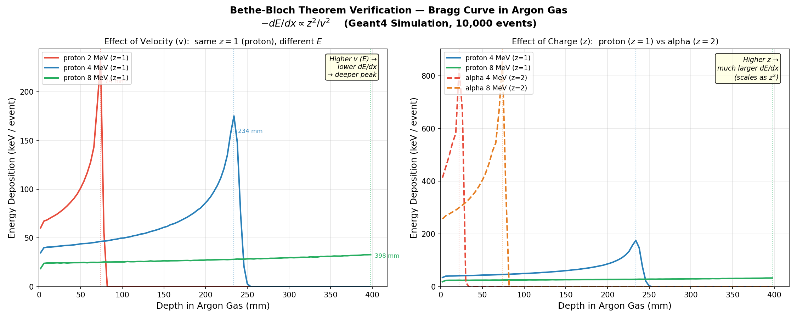

# Bethe-Bloch Theorem Verification — Bragg Curve Study

> A **Geant4 Monte Carlo simulation** verifying the Bethe-Bloch formula by studying how energy deposition (dE/dx) depends on projectile **charge (z)** and **velocity (v)**.  
> Medium: Argon gas | Particles: Proton (z=1), Alpha (z=2) | Energies: 2, 4, 8 MeV | Geant4 v11.3

---

## Result



---

## What the Plots Show

### Left — Velocity Study (same z=1, different energy)

| Particle | Energy | Peak Depth | Peak dE/dx |
|---|---|---|---|
| Proton | 2 MeV | ~78 mm | ~210 keV/event |
| Proton | 4 MeV | ~234 mm | ~175 keV/event |
| Proton | 8 MeV | ~398 mm | ~33 keV/event |

**Higher velocity → lower dE/dx → deeper Bragg peak** — confirms **–dE/dx ∝ 1/v²** ✓

### Right — Charge Study (proton z=1 vs alpha z=2)

| Particle | z | Energy | Peak dE/dx |
|---|---|---|---|
| Proton | 1 | 4 MeV | ~175 keV/event |
| Alpha | 2 | 4 MeV | ~750 keV/event |
| Ratio | — | — | ~4.3× ≈ z² = 4 |

**Alpha deposits ~4× more energy than proton at same energy** — confirms **–dE/dx ∝ z²** ✓

---

## Physics — The Bethe-Bloch Formula

The mean energy loss per unit path length of a charged particle in matter is given by:

```
            z² · q⁴ · N · Z          2mₑv²
–dE/dx  =  ─────────────────  · ln( ──────── )
              4πε₀² · mₑv²               I
```

Simplified dependence:

```
–dE/dx  ∝  z² / v²
```

where:
- **z** = charge number of the projectile (proton: z=1, alpha: z=2)
- **v** = velocity of the projectile (related to kinetic energy E)
- **Z** = atomic number of the target medium (Argon: Z=18)
- **I** = mean excitation potential of the medium
- **mₑ** = electron rest mass

**Two key consequences simulated here:**

1. **Velocity dependence** — At lower energy (slower v), the particle spends more time near each electron → stronger interaction → higher dE/dx. This creates the Bragg peak: energy loss rises steeply as the particle decelerates, then drops to zero when it stops.

2. **Charge dependence** — An alpha particle (z=2) interacts with 4× the Coulomb force squared compared to a proton (z=1) at the same velocity. The simulation confirms the peak dE/dx ratio ≈ z₂²/z₁² = 4/1 = 4.

---

## Geometry

```
  [Particle gun, variable particle & energy, +Z direction]
          │   z = 0
          ▼
  ┌────────────────────────┐
  │   Argon gas volume     │  10×10×20 cm³,  z = 0–40 cm
  │   (scoring region)     │  100 bins × 4 mm each (0–400 mm)
  └────────────────────────┘
          ↓
  Energy deposited per bin → printed to terminal → parsed by Python
```

---

## Project Structure

```
Bragg_Curve/
├── CMakeLists.txt
├── main.cc
├── run_proton_2MeV.mac       ← proton, 2 MeV  (z=1, low v)
├── run_proton_4MeV.mac       ← proton, 4 MeV  (z=1, medium v)
├── run_proton_8MeV.mac       ← proton, 8 MeV  (z=1, high v)
├── run_alpha_4MeV.mac        ← alpha,  4 MeV  (z=2)
├── run_alpha_8MeV.mac        ← alpha,  8 MeV  (z=2)
├── plot_bethebloch.py        ← runs all sims + plots both panels
├── include/
│   ├── primary_generator_action.hh  ← exposes GetParticleGun()
│   └── run_action.hh
├── src/
│   ├── run_action.cc         ← prints particle label + depth/edep data
│   └── ...
└── results/
    └── bethebloch_study.png
```

---

## Prerequisites

| Requirement | Version |
|---|---|
| Geant4 | ≥ 11.0 |
| CMake | ≥ 3.16 |
| Python + matplotlib | latest |

---

## Build & Run

```bash
# 1. Source Geant4 environment
source /path/to/geant4/install/bin/geant4.sh

# 2. Build
cd Bragg_Curve
mkdir -p build && cd build
cmake ..
make -j4
cd ..

# 3. Run all simulations + plot in one command
python3 plot_bethebloch.py
```

The script automatically runs all 4 simulations sequentially, parses the output, and produces the two-panel plot. The terminal also prints a summary table:

```
=================================================================
  Run                            Peak depth (mm)   Peak dE/dx
  ---------------------------------------------------------------
  proton 2 MeV (z=1)                       78.0   210.xx keV/ev
  proton 4 MeV (z=1)                      234.0   175.xx keV/ev
  proton 8 MeV (z=1)                      398.0    33.xx keV/ev
  alpha 4 MeV (z=2)                        22.0   750.xx keV/ev
  alpha 8 MeV (z=2)                        78.0   720.xx keV/ev
=================================================================
```

---

## Extending the Study

**Add more energies** — create a new mac file:
```
/run/initialize
/gun/particle proton
/gun/energy 16 MeV
/run/beamOn 10000
```
Add it to `plot_bethebloch.py` in the `v_runs` list.

**Add carbon ion (z=6)** — change in `src/primary_generator_action.cc`:
```cpp
G4ParticleDefinition* particle = table->FindParticle("C12[0.0]");
particle_gun->SetParticleEnergy(48.*MeV);  // 4 MeV/nucleon
```
Expected peak dE/dx ≈ z² × proton = 36× larger than proton at same velocity.

---

## References

- Bethe, H. (1930). *Zur Theorie des Durchgangs schneller Korpuskularstrahlen durch Materie.* Ann. Phys. 5, 325.
- Bloch, F. (1933). *Zur Bremsung rasch bewegter Teilchen beim Durchgang durch Materie.* Z. Phys. 81, 363.
- [NIST PSTAR — Proton Stopping Powers](https://physics.nist.gov/PhysRefData/Star/Text/PSTAR.html)
- [NIST ASTAR — Alpha Stopping Powers](https://physics.nist.gov/PhysRefData/Star/Text/ASTAR.html)
- [Geant4 Collaboration, NIM A 506 (2003) 250–303](https://doi.org/10.1016/S0168-9002(03)01368-8)
